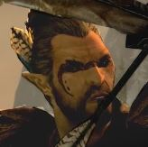

# Featirmor

[  
Character Sheet](https://www.dndbeyond.com/characters/80142407/eMxUt4)

Wood Elf 1  
Cleric (Solonor Thelandira)  
High Forest  
  
  
**BACKSTORY NOTES**  
I'm mentally working up some  stuff, but his name in elven translates as "spirit who watches over the shadow". I'm working in an element where he hates human "civilization" but still working out if it is because his brother and him were part of a delegation that was attacked (killing the brother and leaving him for dead) or something similar, thus playing up his xenophobia and extremist position against re-establishing settlements in the area.  
details still being worked out

Tends to be quite vocal about membership in the Enclave and isn't afraid to make snarky comments showing xenophobia. On the road to assassinations but the good side hasn't allowed for that to happen....yet.
